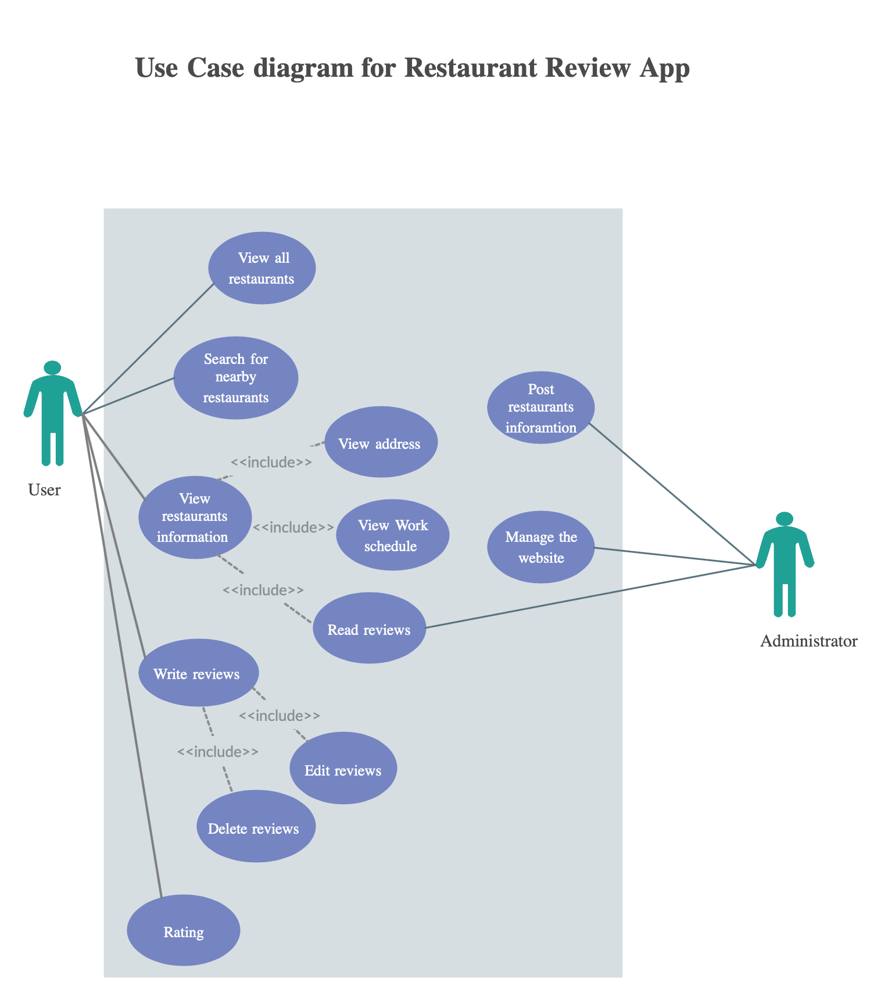

# Restaurant Review App

Restaurant Reviews Its main function is to show a map and list of restaurants in a city, therefore allowing the user to explore available restaurants and see the restaurant's customer reviews in order to make a good lunch/dinner decision suiting their current food preferences.


## Features

-	View all restaurants
-	Search for nearby restaurants
-	View details of restaurants like opening hours, address and reviews
-	Write reviews for a restaurant
-	Edit review 
-	Delete review 
-	Mark a restaurant as favorite


### Use case Diagram


## Technologies Used

```diff
- Css - FrontEnd
- Nodejs - Backend
- Javascript ES6 
- CoucheDB -Database
```
---

### Tools/IDE

```diff
+ Vs code
+ GitBash
+ Git
+ npm
+ Postman

```
---

### Prerequisites
* Node.js - Node Package Manager (npm).


## Installation and run 

1. Clone this repository to your desktop.
2. Open the root folder of the repository in a terminal
3. Run `npm i`
4. Check your python version by `python -V`
5. Start local server:
	- For Python 2.x: `python -m SimpleHTTPServer 8000`
	- For Python 3.x: `python -m http.server 8000`
6. Provide data from node server (see below)
7. Visit [http://localhost:8000](http://localhost:8000)

## Data from node server
```
$ git clone https://github.com/udacity/mws-restaurant-stage-3.git
$ cd mws-restaurant-stage-3
$ npm i
$ npm i sails -g
$ node server

```

**This server must be up and running parallel to the Python server.**

# Local Development API Server

## Architecture
```
Local server
- Node.js
- Sails.js
````

## References 
[Udacity] (https://www.udacity.com/nanodegree?utm_source=gsem_brand&utm_medium=ads_r&utm_campaign=8826748991_c&utm_term=88603507363&utm_keyword=udacity_e&gclid=Cj0KCQjww_f2BRC-ARIsAP3zarHFXx7pjZqDszoUS9amy9wuYV1UjC8rqSHOIUb9xjaxNk2Iuyp6iB4aAl9eEALw_wcB)


## Acknowledgments

- Saudi Information Technology Company (**SITE**)
- KnowledgeHut